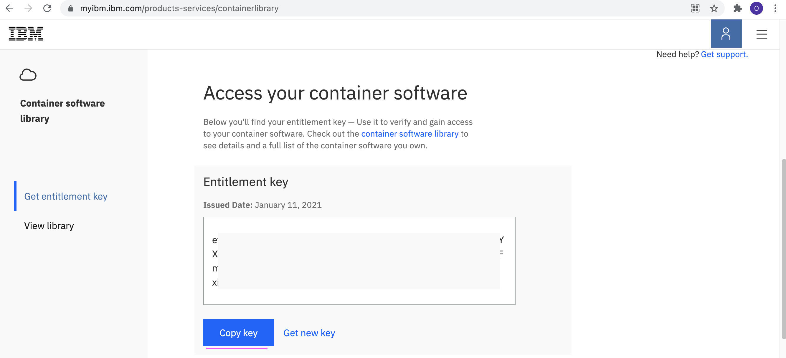

# Installing Watson AIOps AI Manager 3.3 on ROKS 

This document explains about Installing IBM Watson AIOps AI Manager 3.3.0 on ROKS.

Installation script is available in [files/10-install.sh](./files/10-install.sh).

## 1. Update Properties

#### Update entitlement Keys

1. Get `IBM entitlement key` from https://myibm.ibm.com/products-services/containerlibrary



2. Replace the value of the `ENTITLEMENT_KEY` variable in `files/00-config.sh`

```
export ENTITLEMENT_KEY=ABCD
```

## 2. Install AI-Manager

#### 2.1. Login to OCP Cluster

Login to OCP cluster using  `oc login` command .

#### 2.2. Run the install script

Goto the `files` folder and Run the install script as like below.

```
cd files
sh 10-install.sh
```

- It would take around 1hr to complete the istallation. 
- By default the installation is done on the namespace `cp4waiops`
- Keep checking the logs for the status. 
- The same script can be run again and again if the install stopped for any reason.

#### 2.3. Output
 
The installation would be completed and the output could be like this.

```
=====================================================================================================
URL : https://cpd-cp4waiops.aaaaaaaa.ams03.containers.appdomain.cloud
USER: admin
PASSWORD: EpU2m........................jYUz
=====================================================================================================

```

You can use this to login into the WAIOps Console.

## 3. Printing URL, Usr and Pwd

To get the AIMgr URL, user and password anytime after AIMgr install, you can run the below command. This will print the output as like above.

```
cd files
sh 19-print-url-usr-pwd.sh
```

## 4. Cassandra Pods

If you have any probelm with the cassandra pods, run the below command

```
cd files
sh 11-install-sync-cassandra.sh
```

## 5. UnInstall

Refer : https://github.com/IBM/cp4waiops-samples/tree/main/uninstall/3.3

## Reference

The script is based out of https://www.ibm.com/docs/en/cloud-paks/cloud-pak-watson-aiops/3.3.1?topic=manager-starter-installation-cli


## Note

This script can be installed on top existing Watson AIOps Infra Automation 3.3.