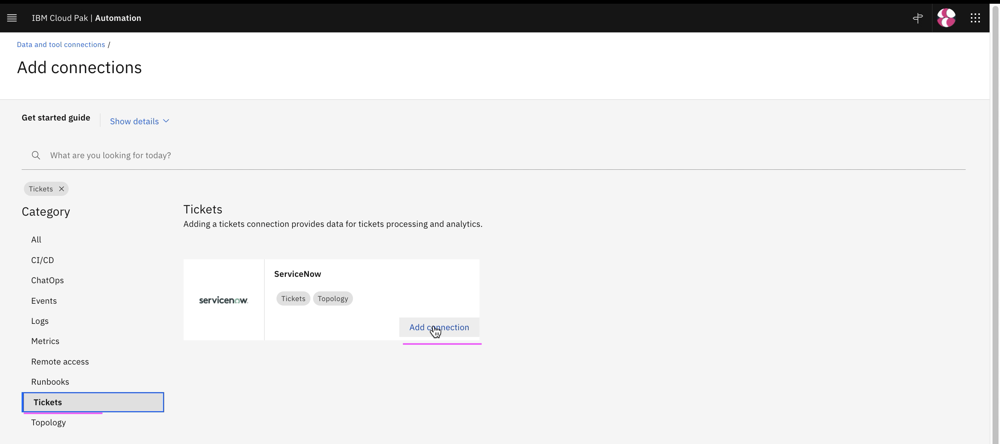

# Setup ServiceNow Integration

This article explains about how to setup ServiceNow Integration in Watson AIOps.

The article is based on the the following.

- RedHat OpenShift 4.8 on IBM Cloud (ROKS)
- Watson AI-Ops 3.2.0

1. Goto the page `Data and tool integrations`

2. Click on  `Add Integration`

3. In the `ServiceNow` card click on the `Add Integration` link

4. Click on `Connect` 

5. Enter the below field values

- Name 
- Description 
- ServiceNow URL
- User
- Password

6. Click on `Next` 

7. Click on `Test Connection` to check the connection with humio

8. Click on `Next`

9. Click on `Next`

10. Enter the below field values

- Dataflow : Off 
- Mode: Historical ..
- Start Date : Last year date
- End Date  : tommorrow date

11. Click on `Done`

12. ServiceNow connection created

