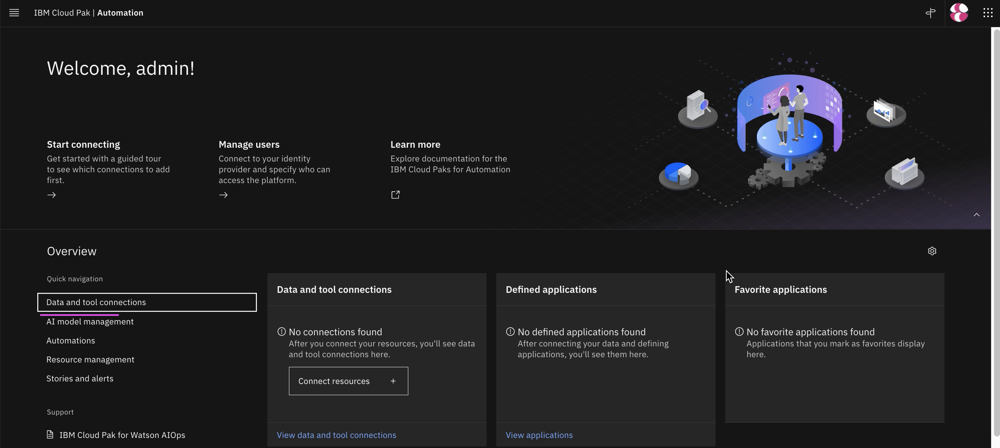
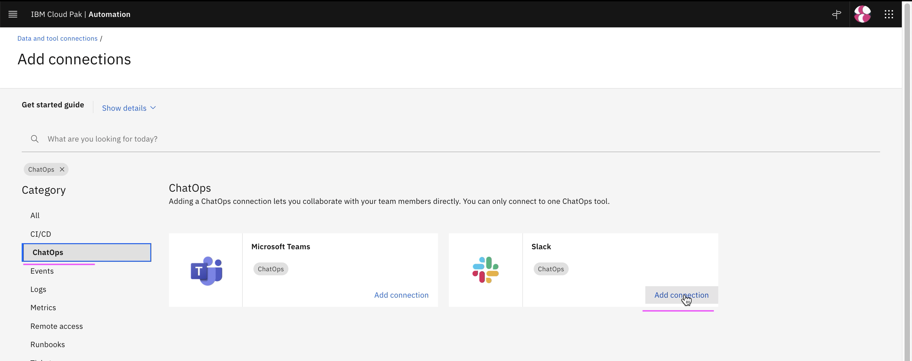
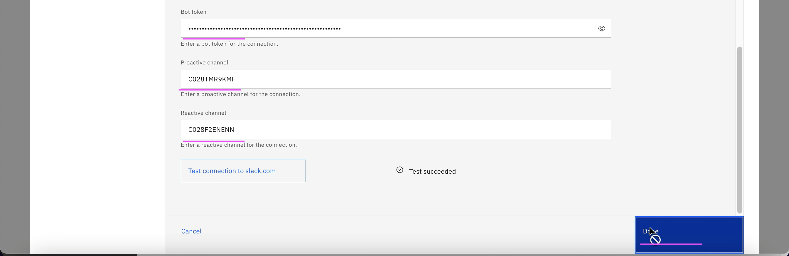
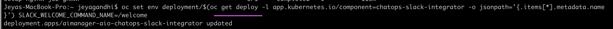

# Create Slack Account and Integrate in Watson AIOps

The article is based on the the following

- RedHat OpenShift 4.8 on IBM Cloud (ROKS)
- Watson AI-Ops 3.2.0

#### Steps

Here are the steps to be done when Configuring Slack for Watson AIOps AI Manager.

- Create Slack Workspace
- Create Slack Channels
- Create Slack App
- Integrate Slack in AI-Ops
- Integrate AI-Ops in Slack
- Update Nginx Certificate
- Create Slash Command

## 1. Create Slack Workspace

Goto https://slack.com/

Click on `Create a New Workspace`


Enter your email, otherwise go with `Continue with Google`


Choose your email


Click on `Create a Workspace`


Enter the workspace name


Enter some default channel name


Skip this step


Click on `Use slack in your browser`


It will open the workspace as like below.

## 2. Create Slack Channels

Click on `Add Channel`


Click on `Create Channel` (this is for proactive)


Enter `Channel Name` and etc

Click on `Create`


Click on `Skip for Now`


Similarly Create another channel (this is for reactive)


## 3. Create Slack App

Goto https://api.slack.com/apps

Click on `Create New App`


Enter Slack ` App Name`.

Choose the above created Workspace name.

Click on `Create App`.


Click on `OAuth & Permissions` from the left menu, 


In `Scopes` section click on `Add an OAuth Scope` button


Add all the listed below

- app_mentions:read
- channels:manage
- channels:read
- chat:write
- files:write
- groups:read
- groups:write
- users:read
- users:read.email


Click on `Install in Workspace`.


Click on `Allow` button.


Copy the `Bot User oAuth Token` to notepad.


Click on left menu `Basic Information`

Click on the `Show` and copy the `Signing Secret` to notepad.


Right click on the Channel and choose the `copy Link` and paste in notepad.

Do the same for both the channels.


## 4. Integrate Slack in AI-Ops

1. In the AI-Ops console, click on `Data and Tool connections` in home page.



2. Click on `Add Connection`.


3. Click on `ChatOps`.

4. Click on `Add Connection`.



5. Click on `Configure`.


3. Enter some  `Name`.

4. Enter the below fields that we copied above

- Signing Secret
- Bot Token
- Proactive Channel
- Reactive Channel

5. Do the `Test Connection`

6. Click on `Done` button.




7. See the Slack integration created below

8. Click on the `Slack` link


9. Copy the slack url


## 5. Update Nginx Certificate

1. Login into AIOps installed cluster using `oc login ...` command .

2. Goto the AIOps installed namespace

```
oc project cp4waiops
```

3. There is a script file [update-nginx.sh](./files/update-nginx.sh)

Run the script.

```
sh files/update-nginx.sh
```

This will update the nginx certificate.

Note: The similar script is also available in  https://pages.github.ibm.com/up-and-running/watson-aiops/AI_Manager/Installation/#ngnix-certificate-for-v31


## 6. Integrate WAIOps in Slack

Click on `Event Subscription` from the left menu

Choose the `On` button in the `Enable Events`


Paste the slack url and the status becomes verified.


Choose the below item to in the `Subscribe to bot Events` section.

- app_mention
- member_joined_channel

Click on `Save Changes` 


Click on the `Interactivity & Shortcuts` from the left menu

Click on the `On` checkbox.

Enter the `Slack Url`

Click on `Save Changes`


## 7. Create Slash Command

Click on `Slash Commands` in the left menu

Click on `Create New Command` button


Enter `/welcome` in the `Command` text box

Enter `Request URL` the slack url copied above from AI-Ops

Enter `Description`

Click on  `Save`


Click on  `reinstall your app`


Click on  `Allow` button


Click on  `Add Apps` for proactive channel


Click on  `Add` button near to the app that was created above.


Click on  `Add Apps` for reactive channel and add the app.


Run the below command to patch the slack integrator with `/welcome`

```
oc set env deployment/$(oc get deploy -l app.kubernetes.io/component=chatops-slack-integrator -o jsonpath='{.items[*].metadata.name }') SLACK_WELCOME_COMMAND_NAME=/welcome
```



The above patch would restart the below nginx pod. Otherwise, you can do it manually.


Enter `/welcome` command in proactive channel and you should see the welcome message like this.


Enter `/welcome` command in reacive channel and you should see the welcome message like this.


## Reference

#### Updating the Nginx Certificate
https://pages.github.ibm.com/up-and-running/watson-aiops/AI_Manager/Installation/#ngnix-certificate-for-v31

https://cloudpak8s.io/aiops/aimgr/install/#updating-the-nginx-certificate

#### Configuring Slack applications for Watson AIOps AI Manager

https://www.ibm.com/docs/en/cloud-paks/cp-waiops/3.1.0?topic=integrations-slack

#### Configuring Slack applications for integration

https://www.ibm.com/docs/en/cloud-paks/cp-waiops/3.1.0?topic=integrations-configuring-slack-integration

#### Others

https://cloudpak8s.io/aiops/aimgr/slack/

To create free Workspace
https://slack.com/get-started#/create