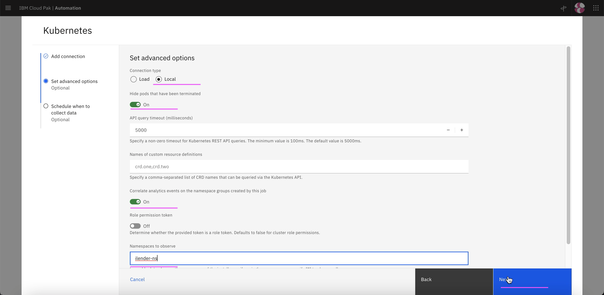

# Setup Kubernetes Integration or Observer

This document explains about how to setup Kubernetes Observer in Watson AIOps.

As part of the kubernetes observer, it is required to communicate with the target cluster. 
Here the target cluster is the local cluster where the AI Manager is installed.

Do the following.

## 1. Create Kube Observer Connection

1. Click on `Add Connection`

2. Choose `Topology`

3. Click on `Add Connection` in the `Topology` tile.

3. Click on `Connect`

4. Enter any value in `Name`,  `Description` and `Data Center`

5. Enter the following

 - Connection Type : Load
 - IP Address : `URL` portion of the `Service Enpoint URL` retrieved in the above section
 - Port : `Port` portion of the `Service Enpoint URL` retrieved in the above section
 - Token : `Access Token` retrieved in the above section
 - Namespace : Any name where you have deployed your app to observe

6. Enter the following

 - Schedule Request : On
 - Interval : 5

7. Click on `Done`

8. Kubernetes connection is created successfully. This might have observer the resources found in the given namespace of the kubernetes cluster and create a Resource group

