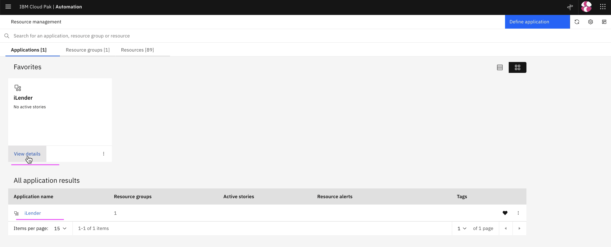

# Create Application using Kubernetes Observer

This document explains about how to setup Kubernetes Integration in Watson AIOps.

## Steps

1. Click on `Application Management`

2. Click on `Define Application`

3. Choose `ilender-ns: ilender-dc`.

This resource group was created by the Kubernetes Observer created before.

4. Click on `Next`

5. Click on `Next`

6. Enter any name to the application

7. Click on `Define Application`

8. Application is created.

Click on `Add to Favourite` link

9. Click on `View Details` to see the app details

10. Topology is displayed

