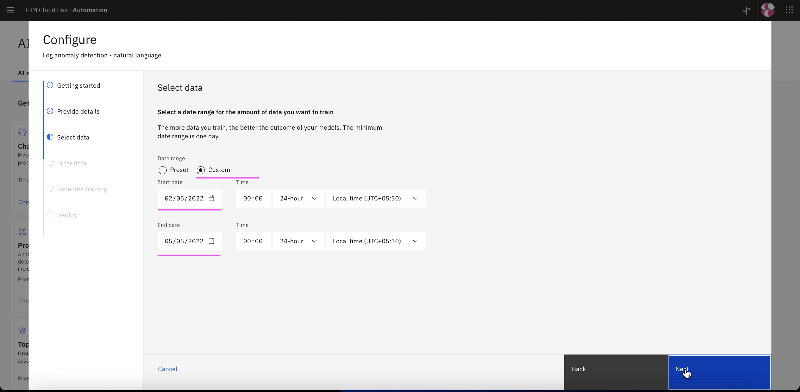

# Create AI-Model Definition for Log Anomaly

This article explains about how to Create Training Definition for Similar Incidents in Watson AIOps.

The article is based on the the following

- RedHat OpenShift 4.8 on IBM Cloud (ROKS)
- Watson AI-Ops 3.2.0

## Steps

1. Click on `AI Model Management` link

2. Click on `Configure` link in `Log anomaly detection - natural language` card

3. Click on `Next` 

4. Enter the below field values

- Configuration Name 
- Configuration Description 

5. Click on `Next` 

4. Enter the below field values

- Custom : On
- Start Date: Yesterday date
- End Date: Tomorrow date

(Whiel training, we will go for live logs and the date of the live logs should fall under this date range)

5. Click on `Next` 

5. Click on `Next` 

5. Click on `Next` 

4. Enter the below field values

- Deployment Type : On Completion

5. Click on `Done` 

5. See the status as `Configured` 

9. Click on `Manage` tab.

The Log Anomaly model training definition is displayed.

