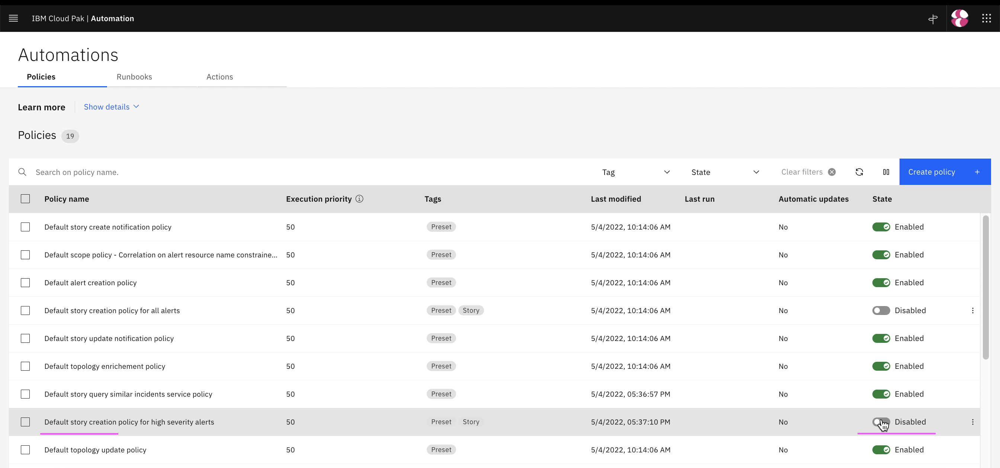
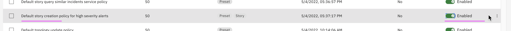

# Enabling Story Creation Policy

This article explain about how to enable a `Default story creation policy for high severity alerts`. 

## Enabling story creation policy

1. Goto `Automation > Policies`

2. Click on  `Enable` for the policy `Default story creation policy for high severity alerts`

3. The policy is enabled

