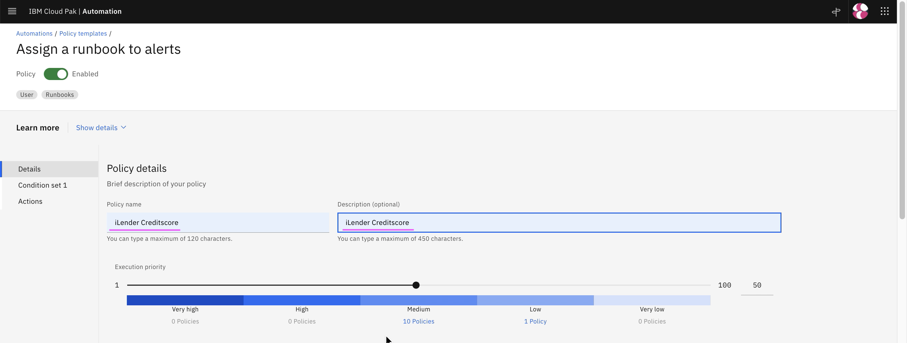
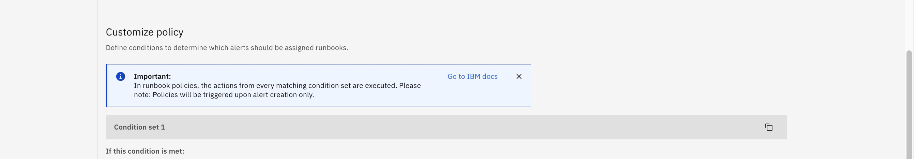
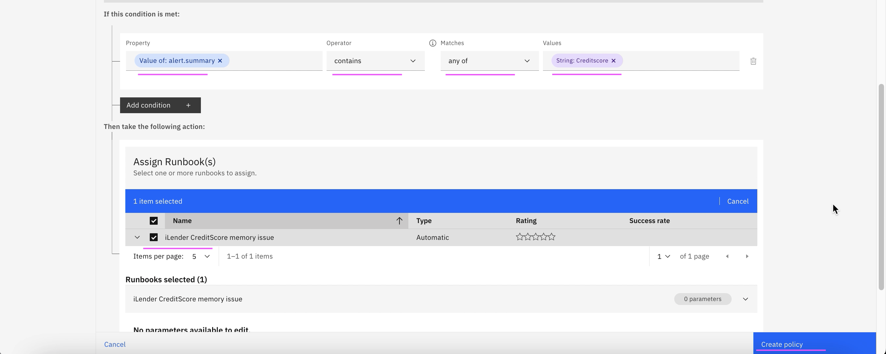

# Runbook Creation

This article explain about how to create run book in Event Manager.

The runbook creating involves the following steps.

- Connect Backend System with SSH
- Create New Automation
- Create RunBook
- Create Trigger


The article is based on the the following

- RedHat OpenShift 4.8 on IBM Cloud (ROKS)
- Watson AI-Ops 3.3.0

## 1. Connect Backend System with SSH

We are going to create a Runbook which has some automation scripts.

Being, it is first time, we need to configure Integrations to connect to the target system, from where the script is going to get executed.

1. Goto the page `Data and tool integrations`

2. Click on  `Add Connection`

3. Click on  `Runbooks`

4. In the `SSH` card click on the `Add Connection` link


5. Click on  `Connect`


6. Copy the ssh value


7. Login into to the target backend system (jump server)

8. Run the command

```
vi ~/.ssh/authorized_keys
```


9. Copy the SSH value copied from the UI and save it.


10. Click on  `Done`


11. SSH Connection is created


## 2. Create New Action

1. Goto `Automation > Actions`

2. Click on  `Create Actions `


3. Enter values for the High lighted fields.


4. Give your script in the `Script` text box.


Example: 
```
cd /root/gandhi/waiops330/runbook
02-runbook-creditscore-ilu1wc.sh
```

This script will get executed when the runbook is started.


5. The content of the script file could be like this.

```.sh
#!/bin/bash

echo " iLender CreditScore runbook"

curl http://ilender-creditscore-ilender-ns.aaaaa.cloud/creditscore/clearLeakMemoryUptoMaxPercentage

echo ""
echo "Process completed"
```

6. Click on `Edit` button in the `target` row.

7. You can enter here the `IP Address` of the target system.

8. Click on  `Save`


9. Click on `Edit` button in the `user` row.

10. You can enter the `user id` here to login into target system.

11. Click on  `Save`


12. You can see the Action created here.


## 3. Create RunBook

1. Goto `Automation > Runbook`

2. Click on  `Create Runbook `


3. Enter `Name` and `Description`.

4. Click on `Add automated step`.

5. Select the listed `Action`, which we created already.

6. Click on `Select this action`.


7. It shows parameter mappings. you can choose `Use Default Value`

8. Click on `Save`.


9. Click on `Publish`.


10. Shows created Runbook.


## 4. Assign Runbook

1. Goto `Automation > Policies`

2. Click on  `Create Policy `


3. Click on  `Create`


4. Give `Name` and `Description`.

5. Give `Property`, `Operator`, `Matches` and `Value`.

Here `Attribute` and `Value` should match the story summary. Then only this runbook will get associated with that story event.

6. Choose the runbook.

7. Click on `Save`.





7. Runbook is created.


