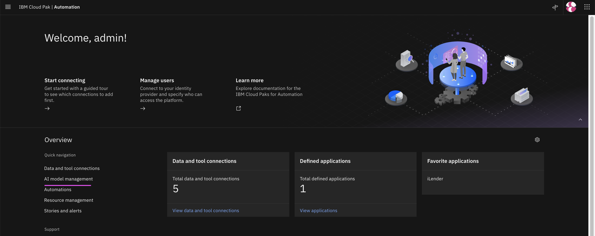
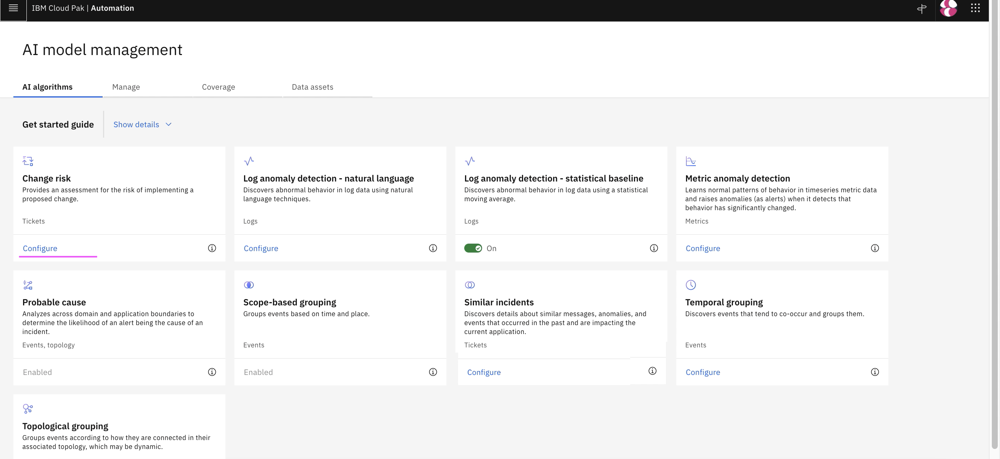
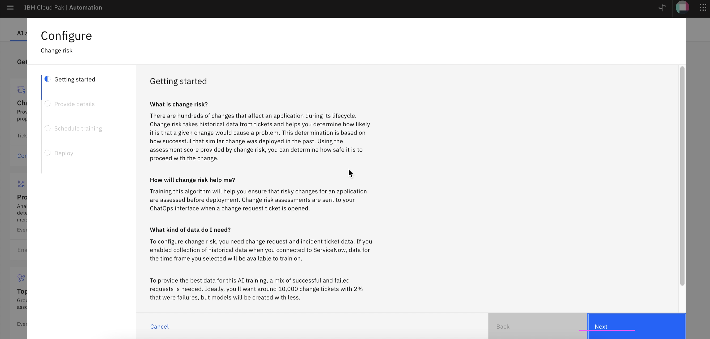
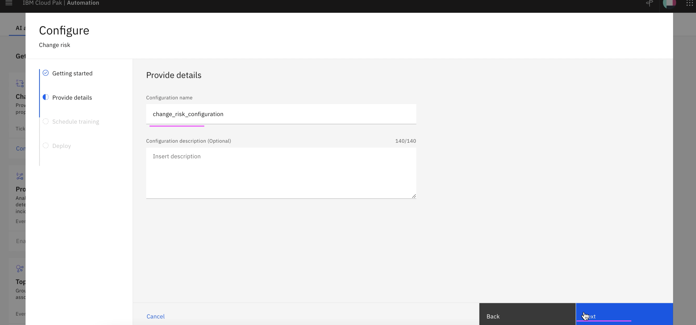
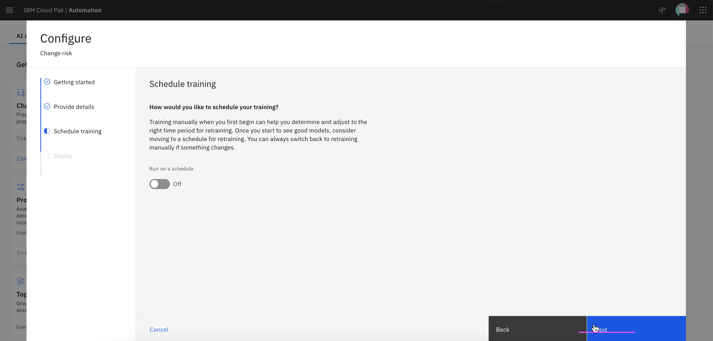
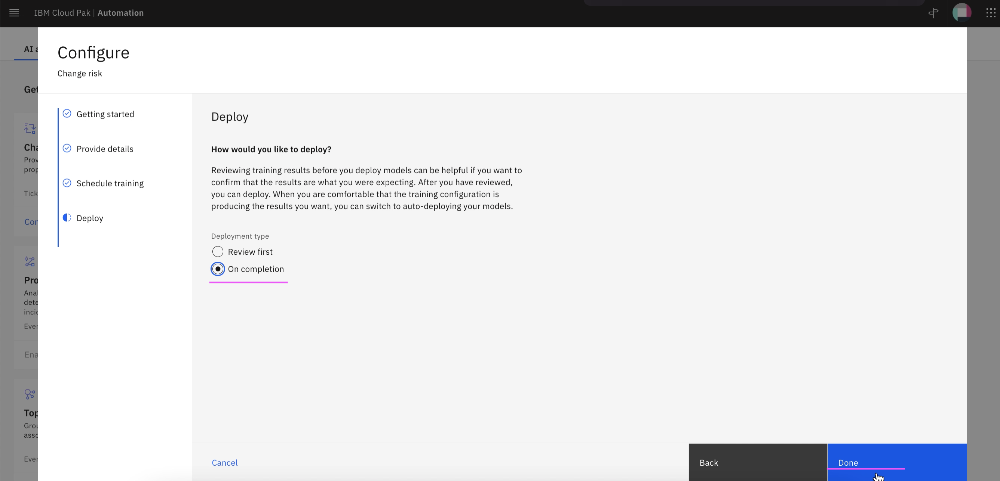
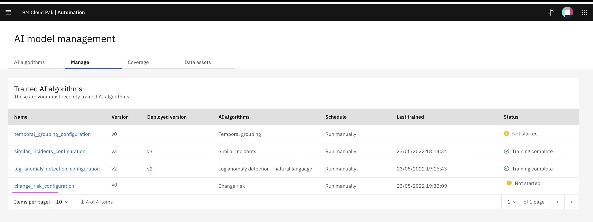

# Create Training Definition for Similar Incidents

This article explains about how to Create Training Definition for Change Risk in Watson AIOps.

The article is based on the the following

- RedHat OpenShift 4.8 on IBM Cloud (ROKS)
- Watson AI-Ops 3.3.0

1. Goto the page `AI Model Management`

2. Click on `Configure` link in `Change Risk` card

3. Click on `Next`

4. Enter the below field values

- Configuration Name 
- Configuration Description 

5. Click on `Next` 

6. Click on `Next` 

7. Click on `Done` 

8. Change Risk training definition is created

9. Click on `Manage` tab.

The Change Risk  training definition is displayed.

