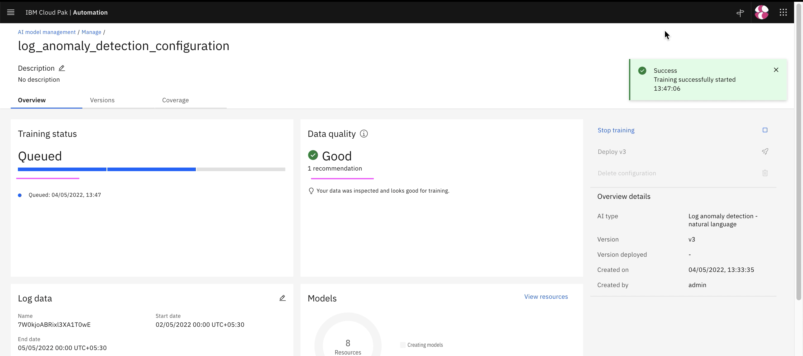

# Training - Log Amomaly

This article explains about how to do Log Amomaly training in Watson AIOps.

The article is based on the the following

- RedHat OpenShift 4.8 on IBM Cloud (ROKS)
- Watson AI-Ops 3.3.0

## 1. Disable Humio Data Flow

Need to disable the Dataflow before generating the load in the application.

1. Make sure the humio DataFlow is disabled.

2. If it is not disabled then disable it.

## 2. Application

We use iLender application here. 

Refer : [20-application-installation](../20-application-installation) to know how the app is deployed.

## 3. Generate Load

Generate load in the application for 20 minutes by refering [21-application-load-generation](../21-application-load-generation).

You need to have 10K lines of logs for each service in the application.

This script will run for 20 minutes and stop.

## 4. Enable Humio Data Flow

Need to enable the Dataflow before starting the training.

1. Make sure the humio DataFlow is enabled.

2. Enter the below field values

- Custom : On
- Start Date: Yesterday date
- End Date: Tomorrow date

## 5. Do Training

1. Goto the page `AI Model Management`

2. Click on `Manage` tab

3. Click on `log-anomaly-detection` link

4. Click on `Edit Data` icon in the `Log Data` section.

5. Enter the below field values

- Custom : On
- Start Date: Yesterday date
- End Date: Tomorrow date

6. Click on `Save`

7. Click on `Start Training` link

The training would start and go for `20 minutes` to `1 hour` based on the data size.

You will have `Training Complete` status once the training is done.

Training is Queued

Training is Queued, but the data is analysed and data quality is good.

Data Retrieval is completed.

Training is completed.

8. Click on `Versions` tab

You can see the version trained and deployed.

9. Click on `Coverage` tab

You can see the iLender application is covered.

10. Click on `View Resources` button

You can see the no. of log lines.

