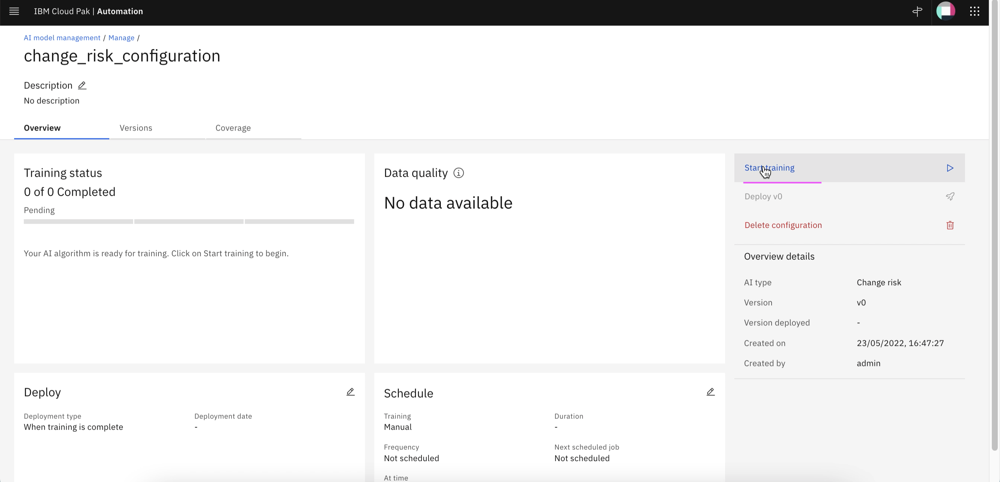

# Training - Change Risk

This article explains about how to do Change Risk training in Watson AIOps.

The article is based on the the following

- RedHat OpenShift 4.8 on IBM Cloud (ROKS)
- Watson AI-Ops 3.3.0

## 1. Pre Requisite

### Sample Incidents for Training

Atleast 5 incidents should have been created in service-now, resolved with proper resolve comments and closed.

Here are the sample incidents from service now.

You can refer to this link to create these incidents in sevicenow. https://github.com/ibm-gsi-ecosystem/watson-ai-ops-snow/tree/main/01-snow-incidents

## 2. Enable Data flow for Training

Need to enable the Dataflow before starting the training.

1. Make sure the ChangeRisk DataFlow is enabled.

2. Enter the below field values

- Custom : On
- Start Date: Yesterday date
- End Date: Tomorrow date
- Mode: Historical ....

## 3. Start Training

1. Goto the page `AI Model Management`

2. Click on `Manage` tab

4. Click on `Start Training` link.

5. Training starts

The training may take 2 to 5 minutes based on the data size.

Training is Queued

Data is analysed and data quality is good.

Training is completed.

6. Click on `Versions` tab

You can see the version trained and deployed.

7. Click on `Coverage` tab

You can see the iLender application is covered.

8. Click on `Manage` in breadcrump.

You can see the Change risk is trained.

