# Viewing Inferencing Results

This article explains about what and where to view Inferencing results.

The article is based on the the following

- RedHat OpenShift 4.8 on IBM Cloud (ROKS)
- Watson AI-Ops 3.3.0

## 1. Slack Story

Slack story shows the incident details to SRE.

1. Slack story for this probelm

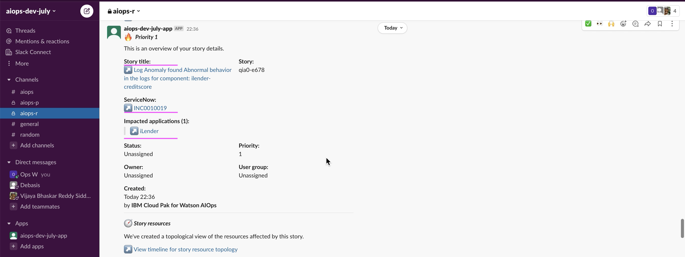
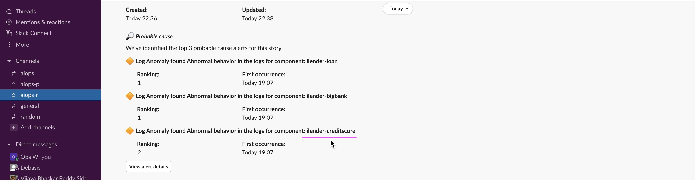
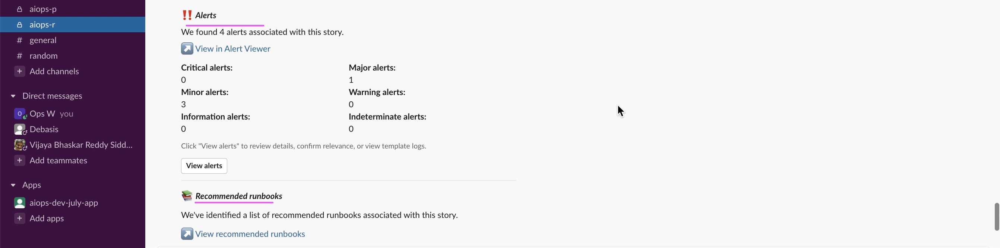
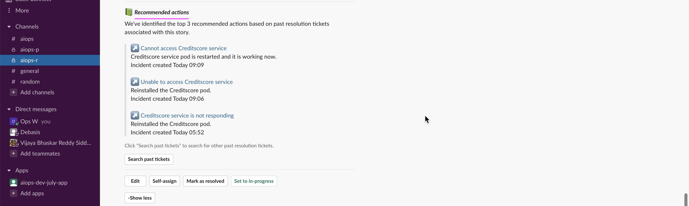

2. Click on `View Alerts` to see the alerts.

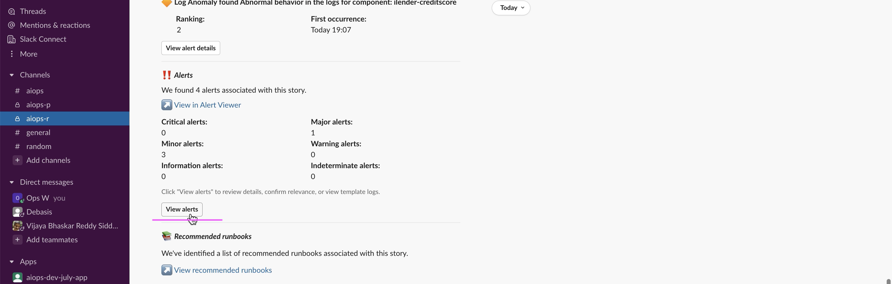

3. Click on `Show More` to see the alerts.

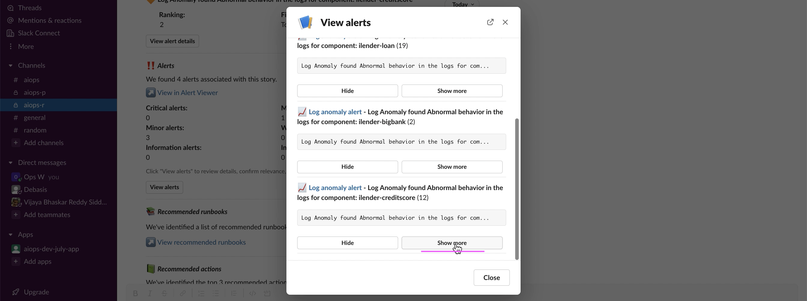

4. Click on `View Logs` to see the logs.

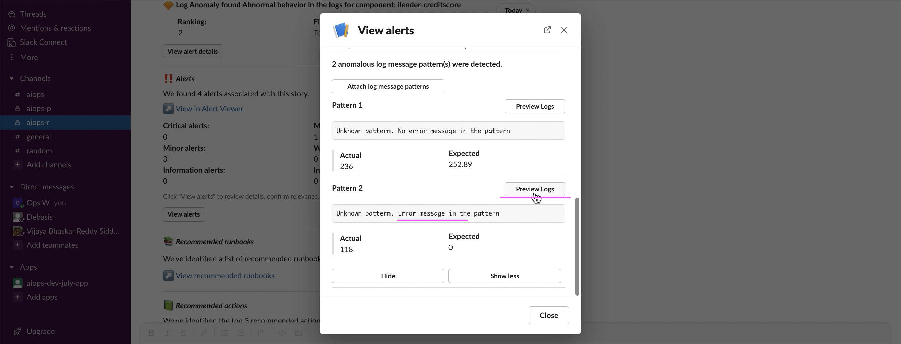

5. Click on `View Logs` to see the logs.

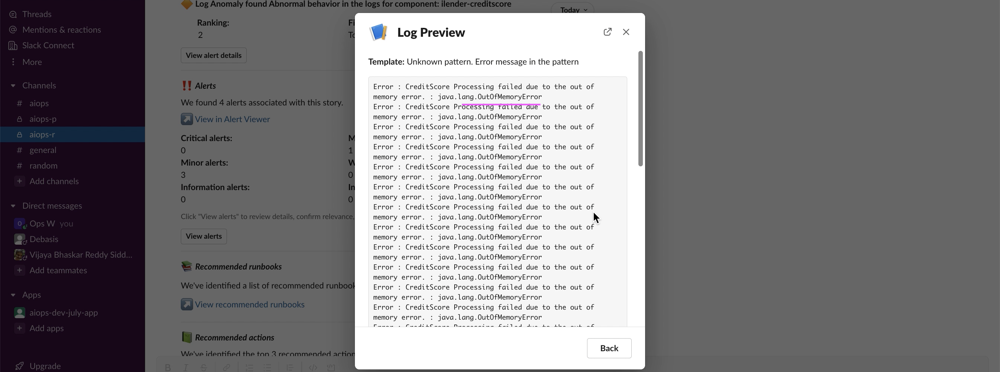

## 3. ServiceNow Incident

An incident get created in ServiceNow as well.

1. Click on `Incident Id` to see the incident details in ServiceNow.

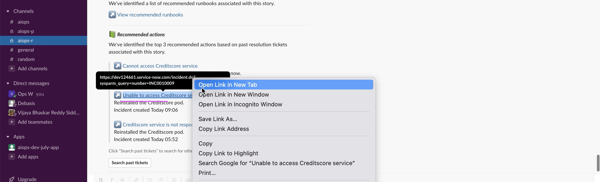

2. Click on `Show More` to see the alerts.

## 4. Recommented Actions

The best recommented actions are displayed from the ServiceNow.

1. Click on `Recommneted actions link` to see the incident details in ServiceNow.

2. The past ticket in ServiceNow is displayed.

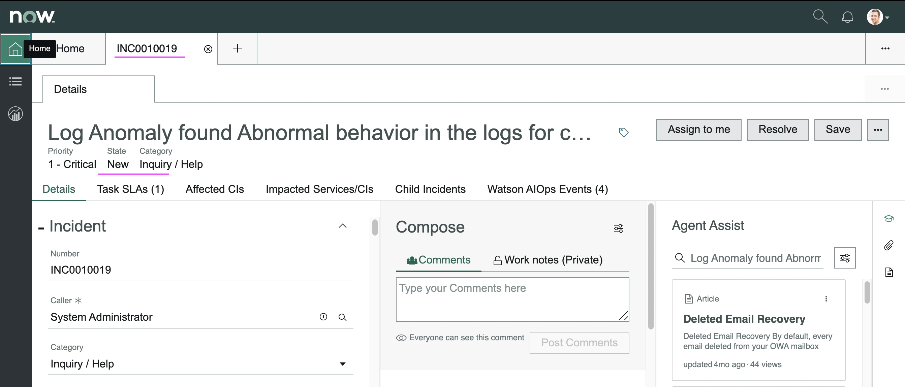

## 3. Application Management - TO BE CORRECTED

In application management also the story is shown.

1. Click on `Story title link` to see the incident details in web console.

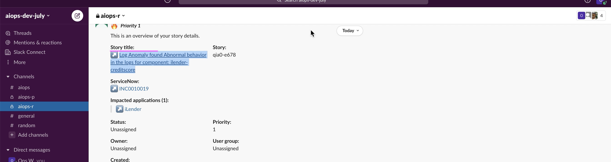

1. Application tiles showing the alerts

2. Click on `View Details` to see the details.

You can see the story and topology.

3. Click on `Hand icon` to see the alerts.

4. Click on `View Story` to see the story viewer.

## 4. Story Viewer

1. Click on `Story title link` to see the story/incident details in web console.

2. Story Viewer shows story and its events in web.

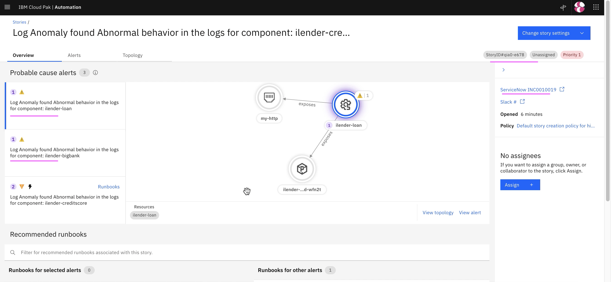

3. Click on `Alerts` to see all the alerts belong to this story.

4. Click on  `Topology` tab to see Topology.

4. The Story tab shows a created story. TODODODOODO

### 4.1 Alerts

1. Choose any of the alerts and it shows alert details.

2. Click on `Topology` to see Topology correlation.

2.  Topology correlation is displayed

### 5. Execute RunBook 

1. Click on `Runbook` icon in the alert.

## 4. Story Viewer1111

1. Click on `Story title link` to see the story/incident details in web console.

2. Story Viewer shows story and its events in web.

2. Click on `Topology Icon` to see Grouping.

3. Click on  `Seasonal Grouping Icon` to see Grouping.

3. Click on  `Topology` tab to see Topology.

## 5. Resolving Incident

1. Click on  `Mark As Resolved` button in Slack Story

2. Click on  `Submit` button to resolve the Slack Story

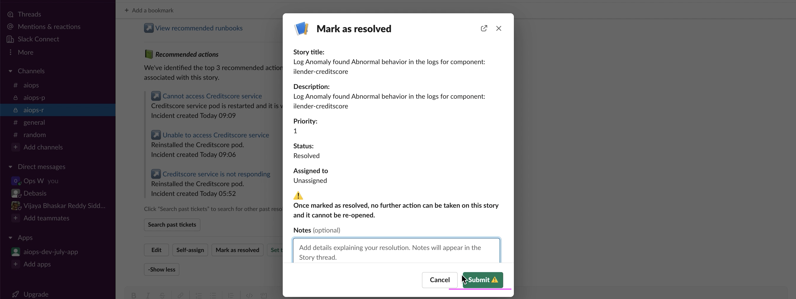

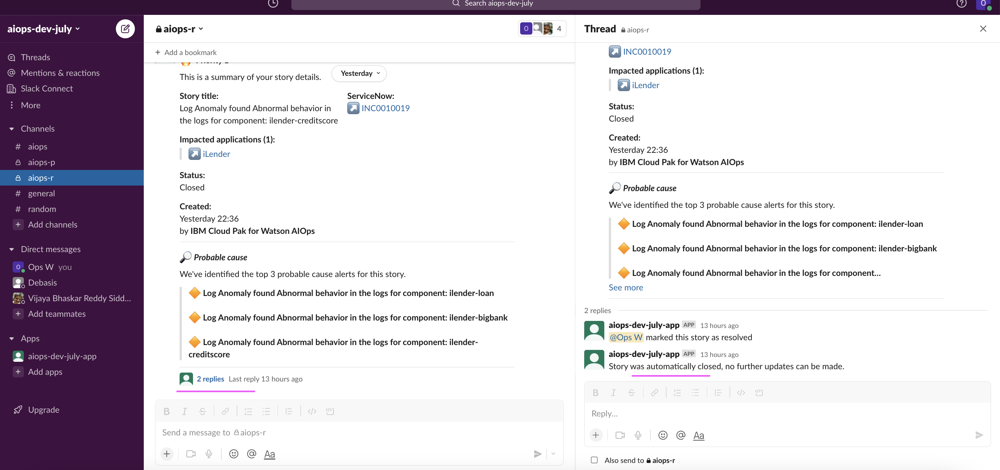
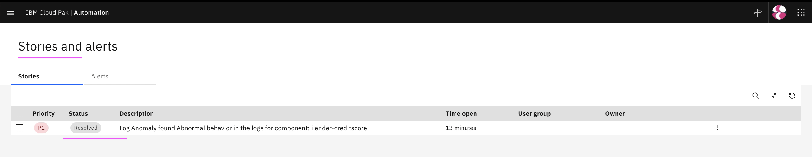
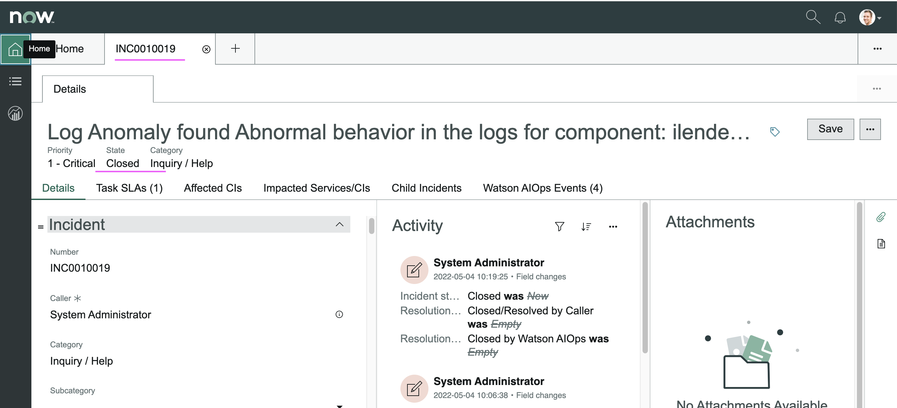
