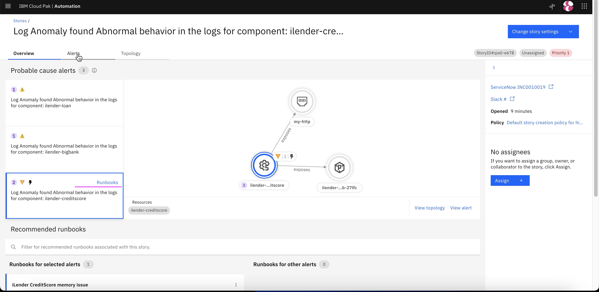
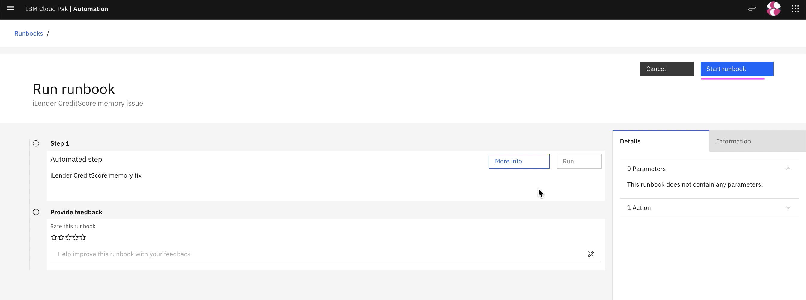
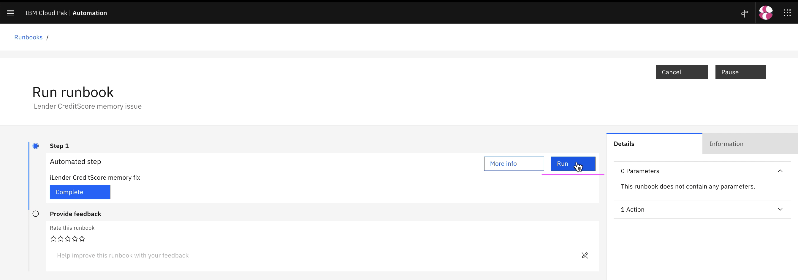
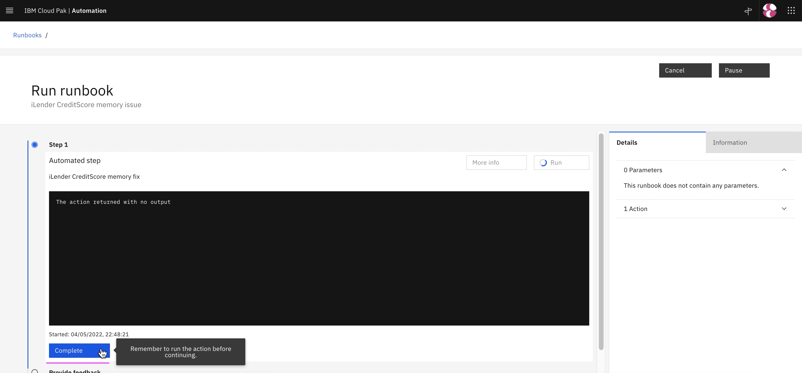
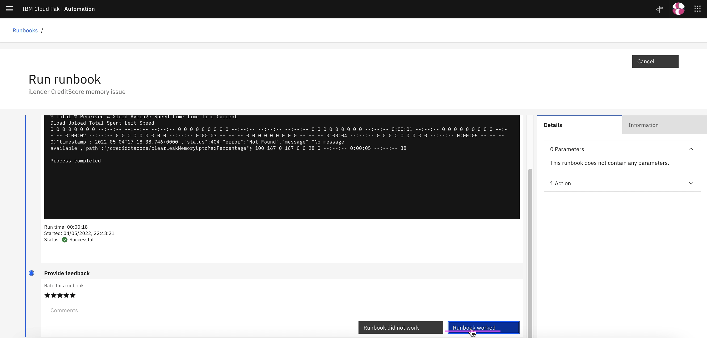

# Viewing Inferencing Results

This article explains about what and where to view Inferencing results.

The article is based on the the following

- RedHat OpenShift 4.8 on IBM Cloud (ROKS)
- Watson AI-Ops 3.3.0

## 1. Slack Story

Slack story shows the incident details to SRE.

1. Slack story for this probelm

2. Click on `View Alerts` to see the alerts.

3. Click on `Show More` to see the alerts.

4. Click on `Preview Logs` to see the logs.

5. You can see the error logs.

## 3. ServiceNow Incident

An incident get created in ServiceNow as well.

1. Click on `Incident Id` to see the incident details in ServiceNow.

2. You can see the incident in ServiceNow.

## 4. Recommented Actions

The best recommented actions are displayed from the ServiceNow.

1. Click on `Recommneted actions` link to see the incident details in ServiceNow.

2. The past ticket in ServiceNow is displayed.

## 3. Application Management - TO BE CORRECTED

In application management also the story is shown.

1. Click on `Story title link` to see the incident details in web console.

1. Application tiles showing the alerts

2. Click on `View Details` to see the details.

You can see the story and topology.

3. Click on `Hand icon` to see the alerts.

4. Click on `View Story` to see the story viewer.

## 4. Story Viewer

1. Click on `Story title link` to see the story/incident details in web console.

2. Story Viewer shows story and its events in web.

3. Click on `Alerts` to see all the alerts belong to this story.

4. Click on  `Topology` tab to see Topology.

5. The Story tab shows a created story. TODODODOODO

### 4.1 Alerts

1. Choose any of the alerts and it shows alert details.

2. Click on `Topology` to see Topology correlation.

3.  Topology correlation is displayed

### 5. Execute RunBook 

1. Click on `Runbook` icon in the alert.

2. Select the `Preview` menu.

3. Click on `Run runbook`.

4. Click on `Run runbook`.

5. Click on `Run` in `Step1`.

6. Click on `Complete` in `Step1`.

7. Click on `Run` in `Step1`.

## 5. Resolving Incident

1. Click on  `Mark As Resolved` button in Slack Story

2. Click on  `Submit` button to resolve the Slack Story

3. Story is closed automatically once it is resolved

4. In `Stories and Alerts` page also the story is shown as `Resolved`

5. In `ServiceNow` also the story is `Resolved`

