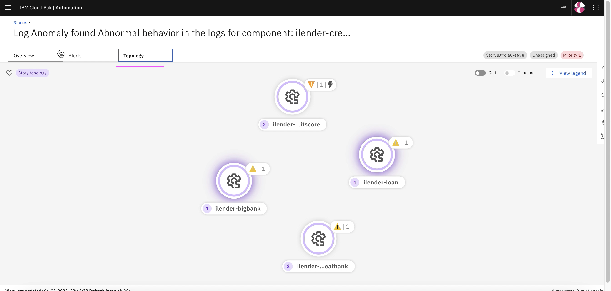

# Viewing Inferencing Results

This article explains about what and where to view Inferencing results.

The article is based on the the following

- RedHat OpenShift 4.8 on IBM Cloud (ROKS)
- Watson AI-Ops 3.3.0

## 1. Slack Story

Slack story shows the incident details to SRE.

1. Slack story for this probelm

2. Click on `View Alerts` to see the alerts.

3. Click on `Show More` to see the alerts.

4. Click on `Preview Logs` to see the logs.

5. You can see the error logs.

## 2. ServiceNow Incident

An incident get created in ServiceNow as well.

1. Click on `Incident Id` to see the incident details in ServiceNow.

2. You can see the incident in ServiceNow.

## 3. Recommented Actions

The best recommented actions are displayed from the ServiceNow.

1. Click on `Recommneted actions` link to see the incident details in ServiceNow.

2. The past ticket in ServiceNow is displayed.

## 4. Story Viewer

## 4.1. Stories and alerts

This section shows all the stories and alerts available in the system.

## 4.2. Story Details

The story can be opened through the Slack as well.

1. Click on `Story title link` to see the story/incident details in web console.

## 4.2.1. Story 

1. Story Viewer shows story and its events in web.

## 4.2.2. Alerts

1. Click on `Alerts` to see all the alerts belong to this story.

2. Choose any of the alerts and it shows alert details.

3. Click on `Topology` to see Topology correlation.

4.  Topology correlation is displayed

## 4.2.3. Topology 

1. Click on  `Topology` tab to see Topology.

