# Resolving Incidents via Runbook

This article explains about how to resolve incidents using the Runbook

The article is based on the the following

- RedHat OpenShift 4.8 on IBM Cloud (ROKS)
- Watson AI-Ops 3.3.0

## 1. Execute RunBook 

1. Click on `Runbook` icon in the alert.

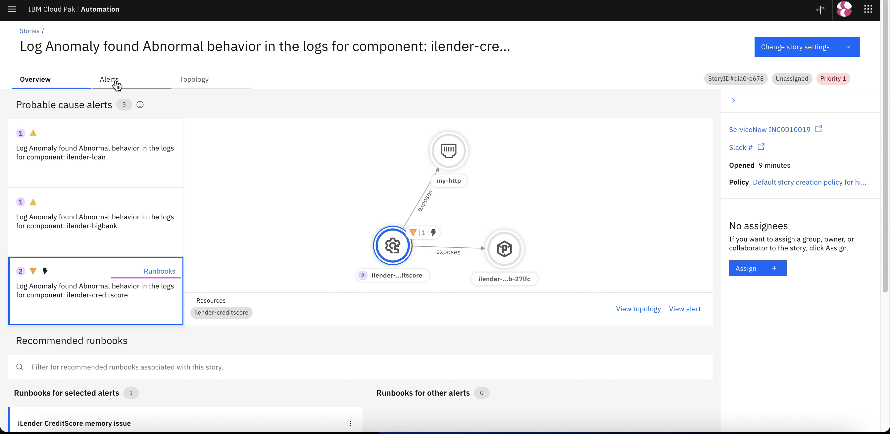

2. Select the `Preview` menu.
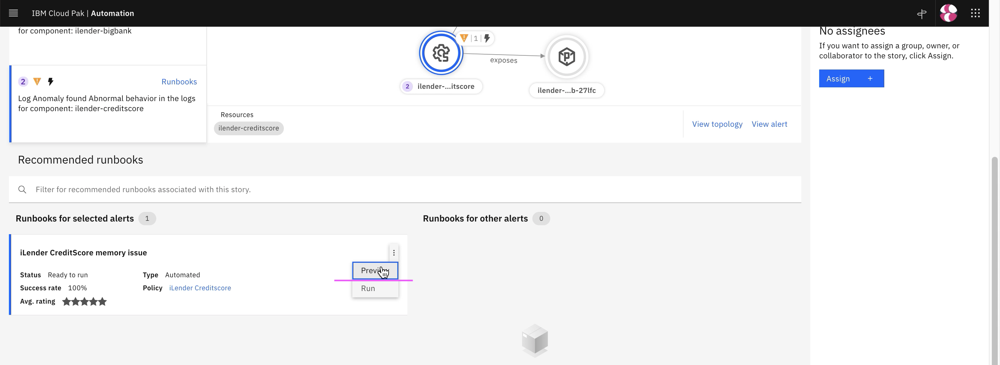

3. Click on `Run runbook`.
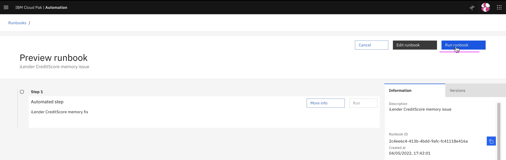

4. Click on `Run runbook`.

5. Click on `Run` in `Step1`.
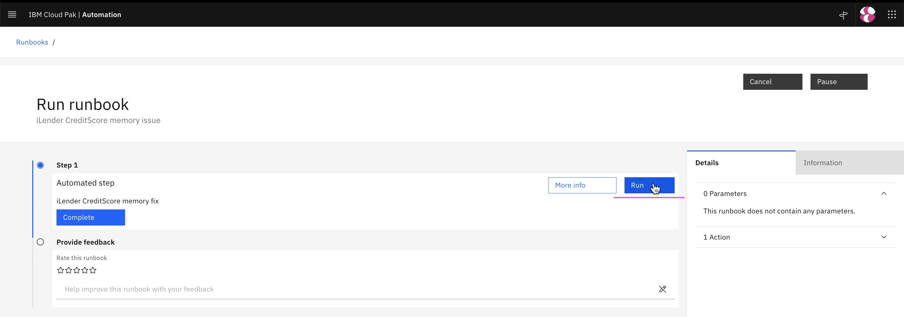

6. Click on `Complete` in `Step1`.
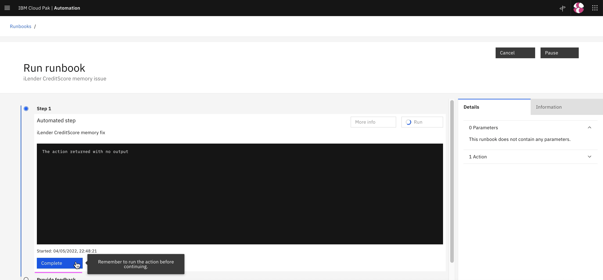

7. Click on `Runbook worked`.
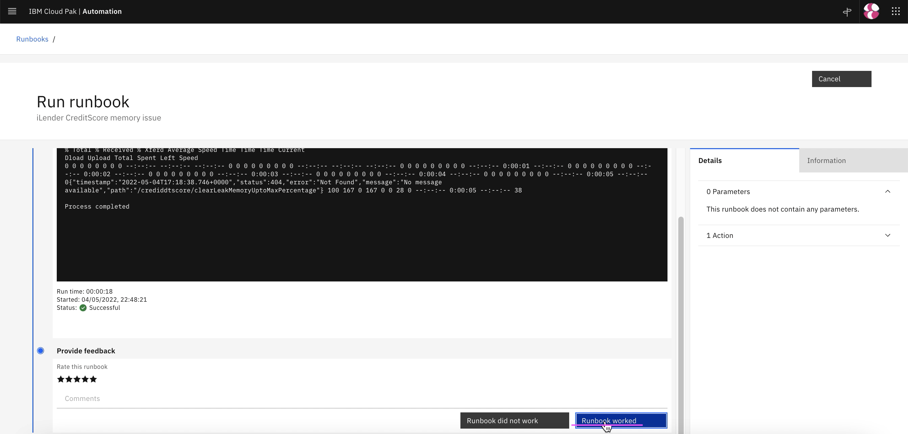

The runbook is executed. The probelm should have been resolved.

## 2. Mark resolved in Story

1. Click on  `Mark As Resolved` button in Slack Story
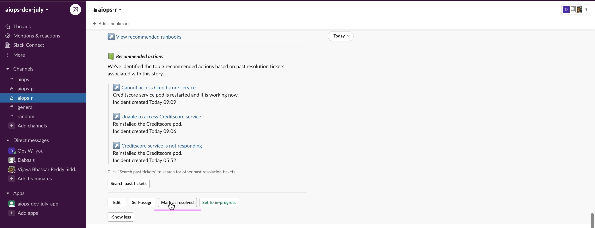

2. Click on  `Submit` button to resolve the Slack Story
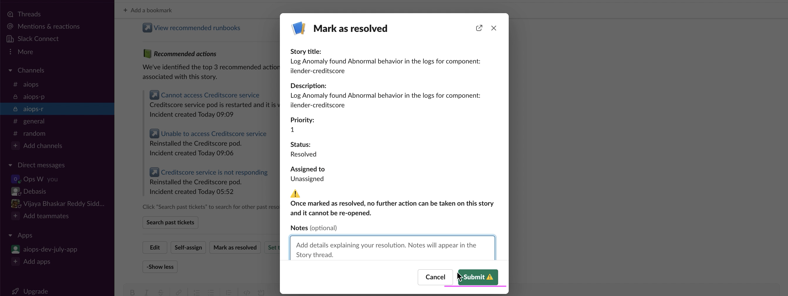

3. Story is closed automatically once it is resolved
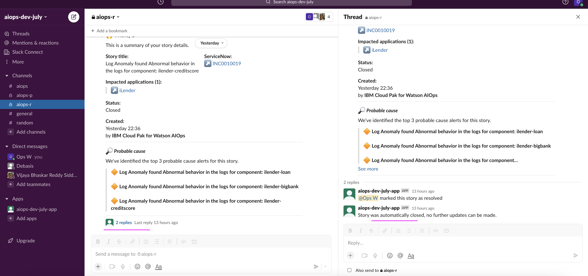

4. In `Stories and Alerts` page also the story is shown as `Resolved`
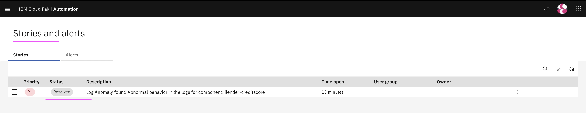

5. In `ServiceNow` also the story is `Resolved`
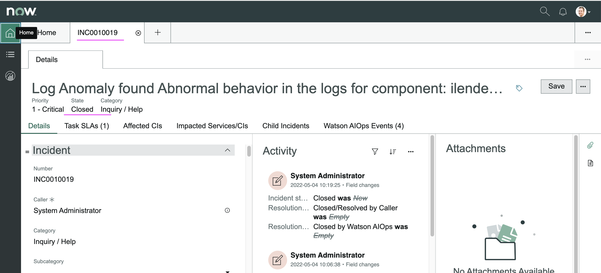
