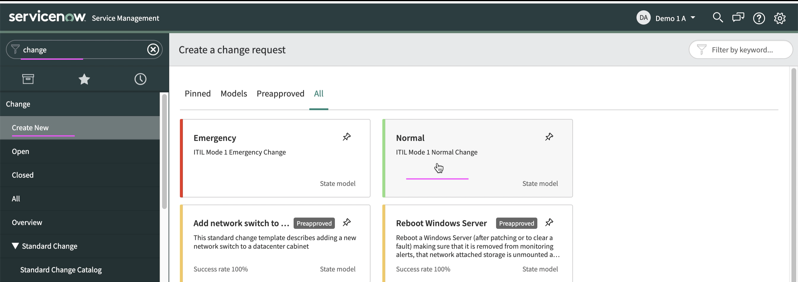

# Run Demo (Inferencing)

This article explains about how to run the Inferencing for Change Risk in Watson AIOps.

The article is based on the the following

- RedHat OpenShift 4.8 on IBM Cloud (ROKS)
- Watson AI-Ops 3.3.0

## 1. Enable Data flow in ServiceNow Integration

1. Choose the `ServiceNow` integration from the `Data and Tool integrations` page.

2. Enable the `Data flow` on.

3. Select the option `Live data for Continious ticket data collection`.

4. Save it.

## 2. Create Change Request in ServiceNow

Create a new Change Request in ServiceNow by logging in as a different user (should not use the same user used in the `Data and Tool integrations`).

## 3. View Slack Story 

A chatops notification is received for the newly opened CR, indicating the risk involved along with a confidence score in %. 

## 4.View Change Request Notes

In ServiceNow Change Request record, a `Work notes` (under Notes tab) is updated with the risk and confidence score.

