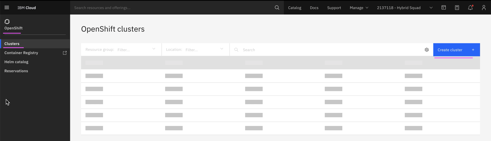
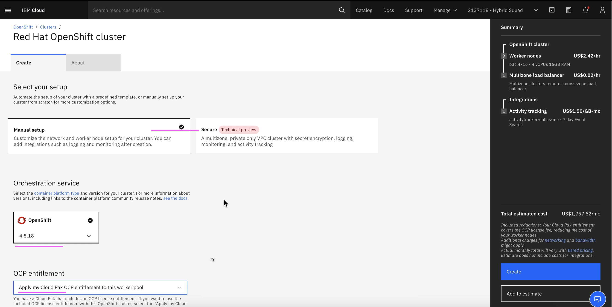
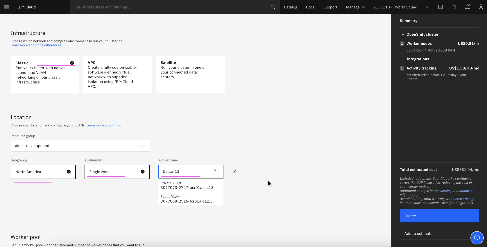
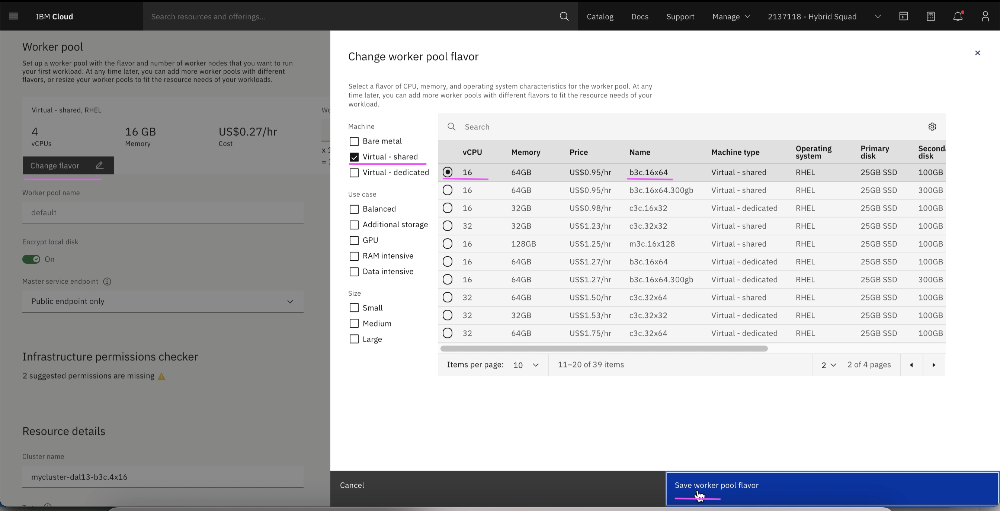
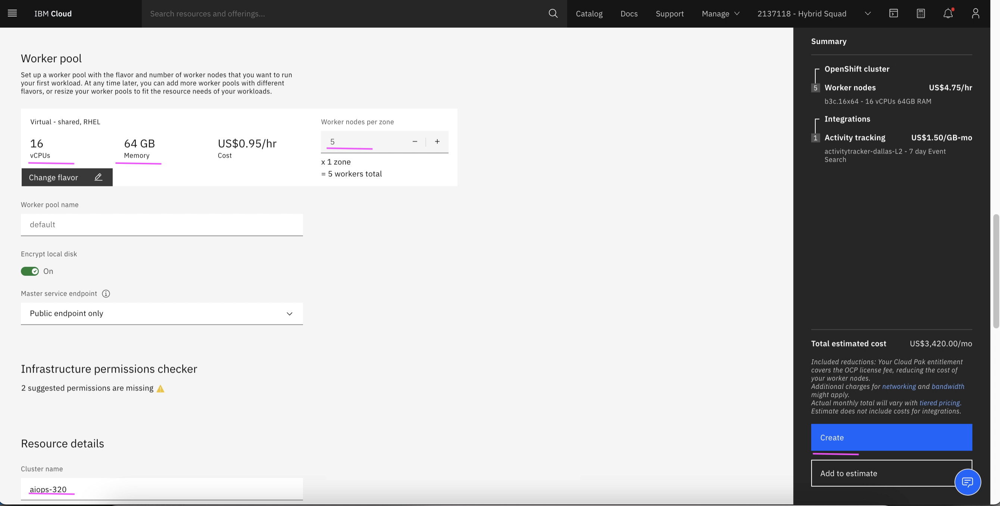

# Installing RedHat Openshift on IBM Cloud (ROKS)

This documentation explains about the RedHat Openshift install on IBM Cloud (ROKS).

## Open Create Clusters Screen

1. Goto http://cloud.ibm.com

2. Choose the menu/buttons `Openshift > Clusters > Create Clusters`

## Version and entitlement

3. Choose `Manual setup`

4. Choose `4.8.18` in Openshift version

5. Choose `Apply my cloud pak OCP entitlement to this worker pool` if available.

## Zones

6. Choose `Classic` in the infrastructure.

7. Choose `Single Zone` in the availability.

8. Choose any value in `Geography` and `Worker zone`

## Flavor

9. Click on `Change Flavor` button.

10. Check the `Virtual-Shared` option.

11. Choose `b3c.16x64` option.

12. Click on `Save worker pool flavour` button

13. Enter `5` in `worker nodes per zone`.

14. Enter some value in  `cluster name`

15. Click on `Create` button

It would start creating a cluster for you. It may take 30 minutes to complete.