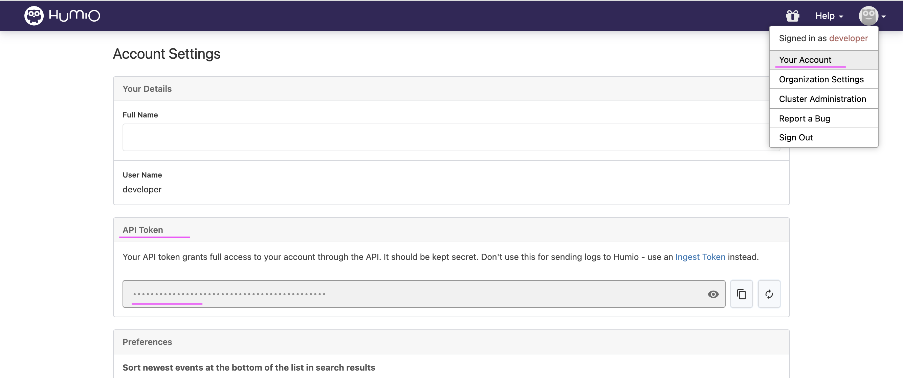
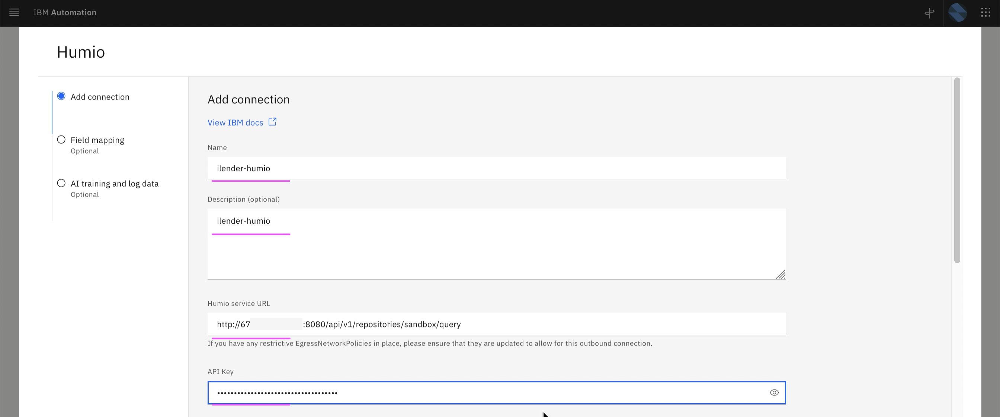
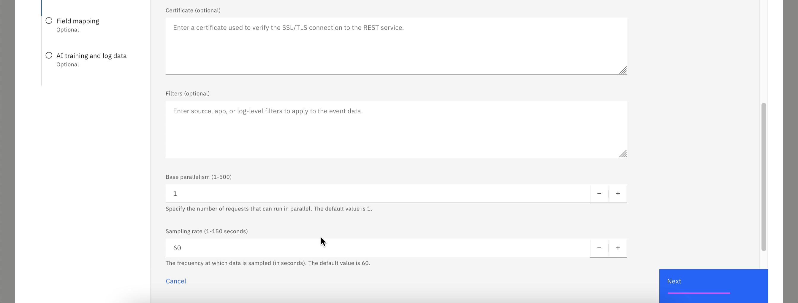
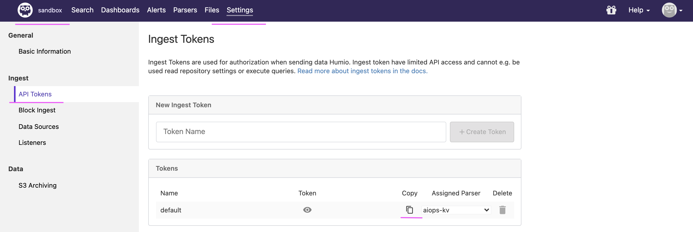

# Installing Humio on RedHat Openshift

This document helps to install Humio on RedHat Openshift Container Platform.

The application logs are pushed to the Humio instance. The WAIOps pulls logs from the Humio and use it for logs anomaly detection.

## 1. Installation

Humio is installed in OpenShift namespace `humio-ns`.

The installation is done via the script [files/install-humio.sh](./files/install-humio.sh). There is a supporting file [files/values.yaml](./files/values.yaml) is also available.

Here are the steps to install

#### 1. Login into OpenShift

Login into OCP using oc login command.

```
oc login ......
```

#### 2. Goto the files folder

Run the below command

```
cd files
```

#### 3. Run the install script


Run the below command to install Humio

```
sh install-humio.sh
```

#### 4. Output
 
The installation would be completed and the output could be like this.

```
================================================================
Humio URL : http://humio-humio-ns.mycluster-aaaaaa.eu-de.containers.appdomain.cloud/
Humio User : developer
Humio Password : humiopassword
================================================================
```

## 2. Using Humio in WAIOps

1. Access the Humio console using the above printed Humio URL, user and password.

2. Goto Account Settings page and get the API Token .



### Humio Connection in WAIOps

#### Humio Service URL

Enter `Humio Service URL` in Humio Integration in WAIOps console. 

Here is the url format.
```
http://<< URL >>/api/v1/repositories/<< REPOSITORY >>/query
```

- << URL >> : The above retrived Humio URL
- << REPOSITORY >> : Repository name in humio. The default repository is `sandbox`

Sample Humio URLs  : 

http://1.1.1.1:8080/api/v1/repositories/sandbox/query

http://humio-humio-ns.mycluster-aaaaaa.eu-de.containers.appdomain.cloud/api/v1/repositories/sandbox/query

[Refer ...](../81-installing-humio-on-openshift)

#### API Key

Enter above retrieved `API Token`





### To Ingest logs in Humio

To Ingest logs in humio, you need `Humio URL` and `API Token` from the respository. 

#### Humio URL

Here is the url format.
```
http://<< URL >>/api/v1/ingest/humio-unstructured
```

- << URL >> : The above retrived Humio URL

Sample Humio URLs  : 

http://1.1.1.1:8080/api/v1/ingest/humio-unstructured

http://humio-humio-ns.mycluster-aaaaaa.eu-de.containers.appdomain.cloud/api/v1/ingest/humio-unstructured


#### API Token

Copy the API Token from ` SandBox >> Settings >> API Token >> Copy `





## 3. ReInstall or Remove

To reinstall or remove this  humio install, you can delete the helm and namespace.

```
helm delete humio-instance

oc delete ns humio-ns
```
`

## 4. Note

This document is based on RedHat OpenShift 4.8 on IBM Cloud (ROKS).
