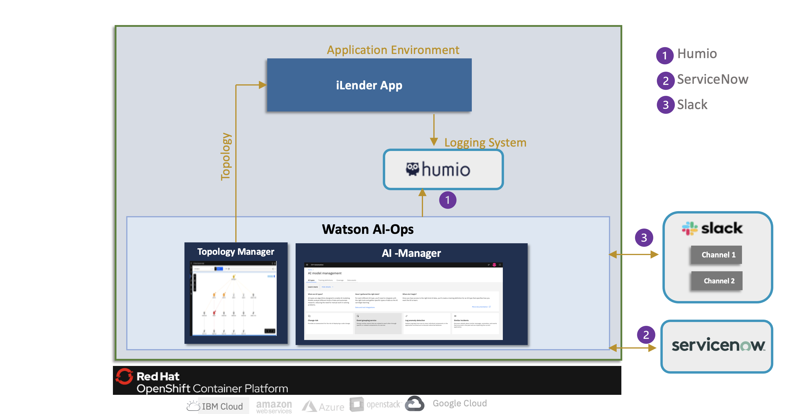

# Watson AIOps 3.3.0 Demo Setup with iLender Application

This article explains about Watson AIOps 3.3.0 demo setup with iLender Application.

The article is based on the the following
 - RedHat OpenShift 4.8 on IBM Cloud (ROKS)
 - Watson AIOps 3.3.0

### Architecture

Here is the architecture that we are going to setup.    

### 1. Watson AIOps 3.3 Installation
<table>
    <tr>
        <td width="4%">S.No</td>
        <td width="84%">Title</td>
        <td width="12%">Reference</td>
    </tr>
    <tr>
        <td>1.1</td>
        <td>Watson AIOps 3.3.0 Installation and demo setup requirements</td>
        <td>

[Details ...](./01-install-prerequisite)
        </td>
    </tr>
    <tr>
        <td>1.2</td>
        <td>Installing Watson AIOps AI-Manager on ROKS</td>
        <td>
[Details ...](./03-install-ai-manager)
        </td>
    </tr>

</table>

### 2. Setup Tools for Integration
<table>
    <tr>
        <td width="4%">S.No</td>
        <td width="28%">Title</td>
        <td width="40%">Description</td>
        <td width="8%">Environment</td>
        <td width="20%">Reference</td>
    </tr>
    <tr>
        <td>3.1</td>
        <td>Install Humio</td>
        <td>Setup Humio in the same OCP Cluster</td>
        <td>OCP Cluster</td>
        <td>

[Details ...](./81-installing-humio-on-openshift)</td>
    </tr>   
    <tr>
        <td>3.2 </td>
        <td>Create Slack acccount</td>
        <td>Setup free slack account and create workspace, channels and slack app</td>
        <td>Slack</td>
        <td>[Details](./32-integrations-slack)</td>
    </tr>   
    <tr>
        <td>3.3 </td>
        <td>Create ServiceNow Instance</td>
        <td></td>
        <td>ServiceNow</td>
        <td>[Details ...](https://developer.servicenow.com/dev.do)</td>
    </tr>
    <tr>
        <td>3.4 </td>
        <td>Create Sample Incidents in Service now</td>
        <td></td>
        <td>ServiceNow</td>
        <td>[Details](https://github.com/ibm-ecosystem-lab/watson-ai-ops-snow/tree/main/01-snow-incidents)</td>
    </tr>
</table>

### 3. Setup Managed Environment
<table>
    <tr>
        <td width="4%">S.No</td>
        <td width="28%">Title</td>
        <td width="40%">Description</td>
        <td width="20%">Reference</td>
    </tr>
    <tr>
        <td>4.1</td>
        <td>Install iLender app</td>
        <td>Install iLender app on the managed environment</td>
        <td>

[Details](./20-application-installation)</td>
    </tr>
</table>

### 4. Setup Data and Tool Configurations
<table>
    <tr>
        <td width="4%">S.No</td>
        <td width="28%">Title</td>
        <td width="48%">Description</td>
        <td width="20%">Reference</td>
    </tr>
    <tr>
        <td>5.1</td>
        <td>Setup Slack Integration</td>
        <td>Integrate with Slack collaboration platform. Need to copy nginx certificate as well.</td>
        <td>

[Details](./32-integrations-slack)
</td>
    </tr>
    <tr>
        <td>5.2</td>
        <td>Setup Humio Integration</td>
        <td>&nbsp;</td>
        <td> 
        
[Details](./30-integrations-humio)</td>
    </tr>
    <tr>
        <td>5.3</td>
        <td>Setup Servicenow Integration</td>
        <td>&nbsp;</td>
        <td>
[Details](./31-integrations-servicenow)
        </td>
    </tr>
    <tr>
        <td>5.4</td>
        <td>Setup Kubernetes Integration</td>
        <td>&nbsp;</td>
        <td>
[Details](./33-integrations-kubernetes-observer)
        </td>
    </tr>    
</table>

### 5. Application Management
<table>
    <tr>
        <td width="4%">S.No</td>
        <td width="76%">Title</td>
        <td width="20%">Reference</td>
    </tr>
    <tr>
        <td>6.1</td>
        <td>Create Application from Resource Groups </td>
        <td>

[Details](./40-application-management)</td>
    </tr>
</table>

### 6. AI Model Management
<table>
    <tr>
        <td width="4%">S.No</td>
        <td width="76%">Title</td>
        <td width="20%">Reference</td>
    </tr>
    <tr>
        <td>7.1</td>
        <td>Create Training Definition for Log Anomaly Detection </td>
        <td>

[Details](./50-ai-model-log-anomaly)  
        </td>
    </tr>
    <tr>
        <td>7.2</td>
        <td>Create Training Definition for Similar Incidents </td>
        <td>

[Details](./51-ai-model-similar-incidents)  
        </td>
    </tr>    
    <tr>
        <td>7.3</td>
        <td>Enable Story Creation Policy </td>
        <td>

[Details](./53-story-creation-policy)  
        </td>
    </tr>    
    <tr>
        <td>7.4</td>
        <td>Runbook Automation </td>
        <td>

[Details](./54-runbook)  
        </td>
    </tr>        
</table>

### 7. Training
<table>
    <tr>
        <td width="4%">S.No</td>
        <td width="28%">Title</td>
        <td width="48%">Description</td>
        <td width="20%">Reference</td>
    </tr>
    <tr>
        <td>8.1</td>
        <td>Generate Load</td>
        <td>Generate the load for the app</td>
        <td>

[Details](./21-application-load-generation)
        </td>
    </tr>    
    <tr>
        <td>8.2</td>
        <td>Log Anomaly Detection training </td>
        <td>Create load in app, enable Data flow on humio integration, selction the mode, start the Log Anomaly Detection training</td>
        <td>[Details](./61-training-log-anomaly)</td>
    </tr>
    <tr>
        <td>8.4</td>
        <td>Similar Incidents training </td>
        <td>Enable Data flow on Servicenow integration, selction the mode, start the Similar Incidents training</td>
        <td>[Details](./62-training-similar-incidents)</td>
    </tr>    
</table>

### 8. Inferencing
<table>
    <tr>
        <td width="4%">S.No</td>
        <td width="28%">Title</td>
        <td width="48%">Description</td>
        <td width="20%">Reference</td>
    </tr>
    <tr>
        <td>9.1</td>
        <td>Demo Script </td>
        <td>Prepare demo script to introduce log anomaly and ingest events</td>
        <td>

[Details](./70-inferencing-demo-script)
        </td>
    </tr>
    <tr>
        <td>9.2</td>
        <td>Run Demo </td>
        <td>Run the demo script to induce error in credtiscore service based on the load</td>
        <td>

[Details](./71-inferencing-run-demo)
        </td>
    </tr>
    <tr>
        <td>9.3</td>
        <td>Check Stories on Web and Slack  </td>
        <td>Check the stories created by WA</td>
        <td>

[Details](./72-inferencing-view-results)
        </td>
    </tr>
    <tr>
        <td>9.4</td>
        <td>Resolving Incident  </td>
        <td>Resolving Incident</td>
        <td>

[Details](./73-resolving-incidents)
        </td>
    </tr>    
</table>

